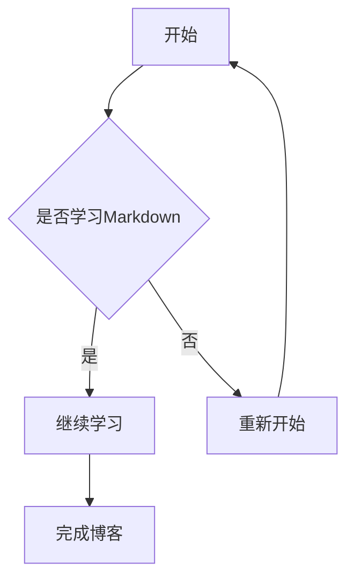
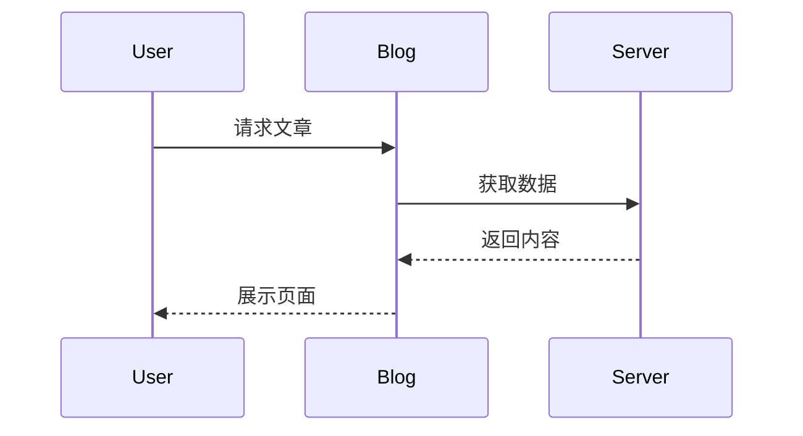

# Markdown 功能测试页面

这是 **Gellow Blog** 的 Markdown 功能测试文章。

用于测试：

- VitePress
- markdown-it
- KaTeX
- Mermaid
- Shiki
- Vue 组件扩展

---

# 1. 基础文本测试

普通文本。

**粗体文字**

*斜体文字*

***粗斜体文字***

~~删除文字~~

`行内代码`

> 这是一段引用文本。
>
> Markdown 可以非常方便地组织技术文章。

---

# 2. 列表测试

## 无序列表

- Vue
- VitePress
- TypeScript
- Markdown


## 有序列表

1. 学习框架
2. 编写代码
3. 部署项目


## 嵌套列表

- 前端
  - Vue
  - Vite
  - CSS
- 后端
  - FastAPI
  - Node.js

---

# 3. Task List 测试

你的博客启用了：

`markdown-it-task-lists`

测试：

- [x] VitePress 配置完成
- [x] Markdown 渲染完成
- [ ] 添加更多组件
- [ ] 完善博客内容

---

# 4. 表格测试

| 技术 | 用途 | 状态 |
| --- | --- | --- |
| VitePress | 博客框架 | ✅ |
| Vue | 页面组件 | ✅ |
| Mermaid | 图表 | ✅ |
| KaTeX | 数学公式 | ✅ |

---

# 5. 图片测试

普通 Markdown 图片：


---

# 6. 链接测试

普通链接：

[VitePress 官方文档](https://vitepress.dev/)

自动链接：

https://github.com/

---

# 7. 代码块测试

## JavaScript

```javascript
function hello(name) {
  console.log(`Hello ${name}`);
}

hello("Gellow");
```

---

## TypeScript

```typescript
interface User {
  name: string;
  age: number;
}

const user: User = {
  name: "Gellow",
  age: 20
};
```

---

## Python

```python
def hello(name):
    print(f"Hello {name}")

hello("Gellow")
```

---

## Vue

```vue
<script setup>
import { ref } from "vue"

const count = ref(0)
</script>

<template>
  <button @click="count++">
    {{ count }}
  </button>
</template>
```

---

# 8. 行号测试

```python {1,3}
for i in range(5):
    print(i)

print("done")
```

---

# 9. 数学公式测试

## 行内公式

爱因斯坦质能方程：

$E=mc^2$

---

## 块公式


$$
\int_0^\infty e^{-x}dx=1
$$


---

## 矩阵


$$
A=
\begin{bmatrix}
1&2\\
3&4
\end{bmatrix}
$$


---

# 10. Mermaid 流程图测试





---

# 11. Mermaid 时序图




---

# 12. 脚注测试


这里是一段带脚注的文本。[^1]


[^1]: 这是脚注内容，用于测试 markdown-it-footnote。


---

# 13. HTML 测试


<div class="custom-box">

这是 HTML 内容块测试。

如果主题支持 CSS，可以显示特殊样式。

</div>


---

# 14. Vue 组件测试

如果博客支持全局 Vue 组件：

```vue
<MyComponent />
```


例如：

```vue
<MusicPlayer />
```


---

# 15. Emoji 测试

🚀 技术博客

🎵 音乐播放器

🤖 AI

🌌 星辰

🔥 项目开发


---

# 16. 分割线测试


---

# 17. 长文章结构测试


## 一级主题

介绍内容。


### 二级主题

详细说明。


#### 三级主题

补充信息。


---

# 18. 引用代码混合测试


> AI 时代，博客不仅是文章展示，更可以成为个人知识系统。


```python
knowledge = {
    "blog": True,
    "ai": True,
    "future": True
}

print(knowledge)
```


---

# 测试结束


如果以上所有内容正常显示：

说明：

- Markdown 渲染正常
- 数学公式正常
- Mermaid 正常
- 代码高亮正常
- 脚注正常
- Vue 扩展正常

🎉 Gellow Blog Markdown 系统测试通过。
